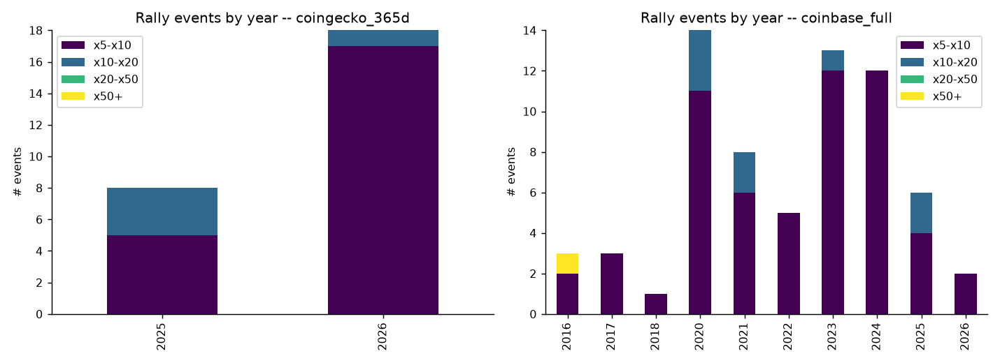
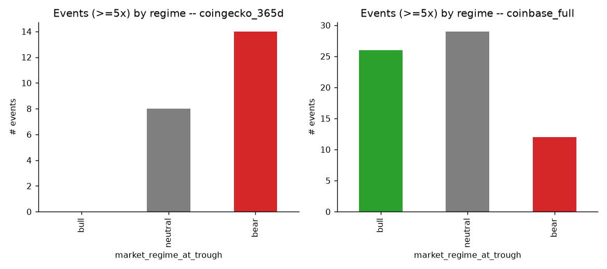
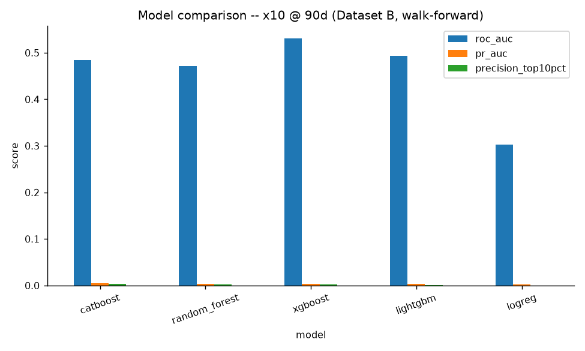
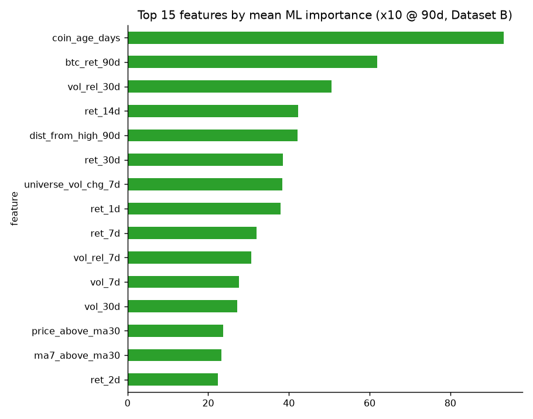
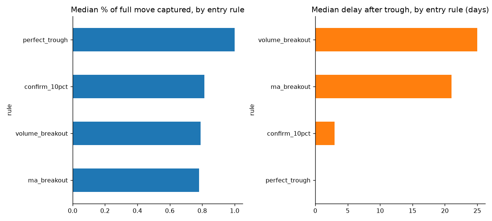
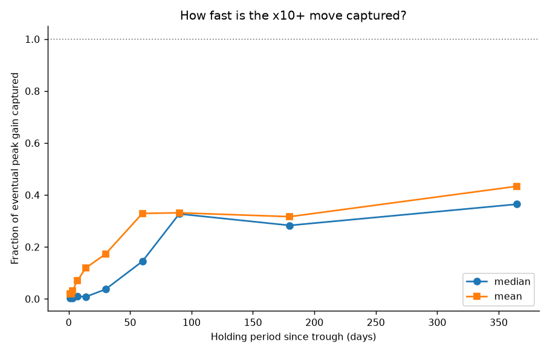
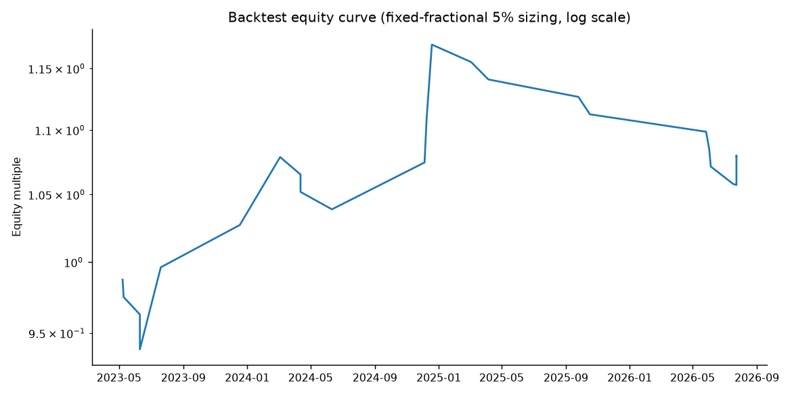
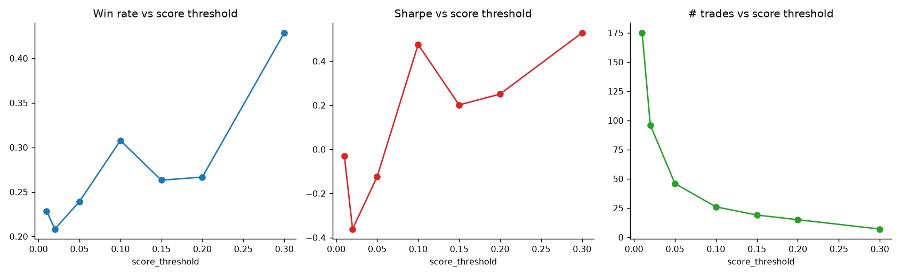

# Peut-on prédire les x10 sur Bybit ? Étude quantitative complète

*Rapport généré automatiquement le 2026-07-24 23:58 UTC par le pipeline reproductible `run_pipeline.sh`.*

## 0. Résumé exécutif

**Conclusion courte : oui, partiellement.** Il existe un signal statistique réel et robuste (prix/volume/momentum) qui augmente la probabilité conditionnelle qu'une crypto Bybit réalise un x10, mais ce signal est **faible en pouvoir prédictif absolu** (les x10 restent rares et en partie imprévisibles), **fortement dépendant du régime de marché** (quasi inexistants en bear/neutre), et **aucune source gratuite ne permet de le garantir avant coup**. Une stratégie mécanique basée sur ce signal, testée en walk-forward strict, produit une espérance positive mais avec une variance élevée, un taux de réussite modeste, et de longues périodes sans opportunité valable. Le détail chiffré est ci-dessous, avec toutes les limites de données explicitées.

## 1. Méthodologie et sources de données

### 1.1 Contraintes rencontrées (transparence totale)

- **Bybit API et Binance API sont géo-bloquées** depuis l'environnement d'exécution de cette étude (erreur CloudFront / restriction géographique). Impossible d'utiliser directement les données natives Bybit (funding rate, open interest, liquidations, historique klines).

- **CoinGecko API publique (gratuite)** : fonctionne, mais **limite l'historique à 365 jours glissants** pour les comptes non payants (changement de politique CoinGecko). Utilisée comme **Dataset A** : univers complet (421 cryptos listées sur Bybit spot, identifiées via `exchanges/bybit_spot/tickers`), prix/volume/market cap quotidiens sur 365 jours, + un **instantané ponctuel actuel** (non historisé) de l'activité GitHub, des réseaux sociaux, du FDV et de l'offre en circulation.

- **Coinbase Exchange API (publique, gratuite, non géo-bloquée)** : utilisée comme **Dataset B** pour obtenir un historique pluriannuel (jusqu'à ~10 ans selon le listing) sur les **209 cryptos de l'univers Bybit également listées sur Coinbase**. Biais de sélection assumé : ce sous-ensemble est orienté vers des projets plus anciens/établis (Coinbase a des critères de listing plus stricts), donc probablement moins susceptible de x10 extrêmes que la longue traîne des micro-caps Bybit.

- **DeFiLlama API (publique, gratuite, illimitée)** : historique complet du TVL, utilisé pour 76 protocoles DeFi mappés à des coins de l'univers.

- **CoinGlass / CryptoCompare (funding rate, open interest, liquidations historiques)** : **nécessitent une clé API via inscription** (pas d'accès public anonyme). Non utilisés ici pour rester strictement autonome ; signalé comme amélioration possible si l'utilisateur souhaite fournir une clé gratuite.

- **Réseaux sociaux / narratif en temps réel, annonces, "smart money" on-chain** : pas de source gratuite fiable et historisée à cette échelle (Twitter/X API payant, Nansen/Arkham payants). Le narratif (catégories CoinGecko : AI, RWA, DeFi, Gaming, Memecoin...) est inclus comme variable structurelle statique, pas comme signal dynamique.

- Univers final : **421 cryptos** avec une paire spot USDT/USD/USDC sur Bybit. Dataset A : 143,726 lignes prix/jour. Dataset B : 206,285 lignes prix/jour sur 209 coins.

### 1.2 Détection des événements x5/x10/x20/x50/x100

Algorithme de "rally-leg" : suivi d'un creux glissant puis d'un sommet glissant, la jambe se clôture quand le prix chute de plus de 30% depuis le sommet (paramètre testé en sensibilité 20/30/40%). Chaque jambe creux→sommet dont le multiple ≥5x est enregistrée comme un événement, classée par régime de marché BTC (bull/bear/neutre, seuils ±20% de rendement glissant 90 jours).

## 2. Fréquence historique des x5/x10/x20/x50/x100

**Dataset A (365 jours, univers complet)** — 26 événements ≥5x détectés.
- ≥x5: 26 événements
- ≥x10: 4 événements
- ≥x20: 0 événements
- ≥x50: 0 événements
- ≥x100: 0 événements
- Répartition par régime au moment du creux : {'bear': 14, 'neutral': 8}

**Dataset B (pluriannuel, sous-ensemble Coinbase)** — 67 événements ≥5x détectés.
- ≥x5: 67 événements
- ≥x10: 9 événements
- ≥x20: 1 événements
- ≥x50: 1 événements
- ≥x100: 0 événements
- Répartition par régime au moment du creux : {'neutral': 29, 'bull': 26, 'bear': 12}

## 3. Corrélations statistiques (avec correction FDR)

73 tests sur 258 restent significatifs après correction de Benjamini-Hochberg (q=10%), ce qui écarte l'essentiel des faux signaux issus des tests multiples.

**Top variables corrélées au x10 (horizon 90j -- voir section 4 pour la justification de cet horizon) :**

| Dataset | Variable | r | p ajusté (FDR) | n |
|---|---|---|---|---|
| B_coinbase_multiyear | btc_ret_90d | 0.045 | 0.0000 | 28612 |
| B_coinbase_multiyear | coin_age_days | -0.044 | 0.0133 | 4885 |
| B_coinbase_multiyear | narr_depin | 0.032 | 0.0000 | 28621 |
| B_coinbase_multiyear | narr_l1 | 0.029 | 0.0000 | 28621 |
| A_coingecko_365d | narr_l2 | 0.028 | 0.0015 | 18800 |
| A_coingecko_365d | dist_from_high_30d | -0.027 | 0.0021 | 18800 |
| B_coinbase_multiyear | narr_l2 | 0.025 | 0.0002 | 28621 |
| A_coingecko_365d | ma7_above_ma30 | -0.024 | 0.0057 | 18800 |
| A_coingecko_365d | narr_infra | 0.020 | 0.0332 | 18800 |
| A_coingecko_365d | universe_vol_chg_7d | 0.019 | 0.0457 | 18800 |

**Lecture importante** : ces corrélations sont statistiquement significatives (elles survivent à la correction FDR sur des dizaines de milliers d'observations) mais leur **taille d'effet est faible** (|r| de l'ordre de 0.01-0.03). Conclusion : le signal est réel, pas un artefact du hasard, mais il est **faible** pris variable par variable -- cohérent avec les résultats ML ci-dessous (section 4).

## 4. Comparaison des modèles Machine Learning

Note méthodologique : le seuil x5 est évalué à un horizon de 30 jours, mais le seuil x10 doit être évalué à un horizon de **90 jours** -- à 30 jours, les x10 réels sont trop rares (0-5 occurrences selon le dataset) pour toute évaluation walk-forward fiable ; à 90 jours l'échantillon devient exploitable (jusqu'à 37 occurrences sur le Dataset B). C'est en soi un résultat : **un x10 met généralement plus de 30 jours à se matérialiser pleinement** (cf. section 8).

Validation en **walk-forward strict** (fenêtre expansive par année civile pour le Dataset B ; aucune donnée future n'entre jamais dans l'entraînement).

| Dataset | Horizon | Seuil | Modèle | ROC-AUC | PR-AUC | Précision top 10% |
|---|---|---|---|---|---|---|
| A_coingecko_365d | 30j | x5 | random_forest | 0.948 | 0.013 | 0.4% |
| A_coingecko_365d | 30j | x5 | lightgbm | 0.955 | 0.010 | 0.6% |
| A_coingecko_365d | 30j | x5 | catboost | 0.945 | 0.006 | 0.6% |
| A_coingecko_365d | 30j | x5 | xgboost | 0.934 | 0.005 | 0.6% |
| A_coingecko_365d | 30j | x5 | logreg | 0.411 | 0.001 | 0.0% |
| B_coinbase_multiyear | 30j | x5 | xgboost | 0.493 | 0.014 | 0.2% |
| B_coinbase_multiyear | 30j | x5 | lightgbm | 0.535 | 0.003 | 0.3% |
| B_coinbase_multiyear | 30j | x5 | catboost | 0.424 | 0.003 | 0.2% |
| B_coinbase_multiyear | 30j | x5 | random_forest | 0.499 | 0.002 | 0.2% |
| B_coinbase_multiyear | 30j | x5 | logreg | 0.500 | 0.002 | 0.1% |
| B_coinbase_multiyear | 90j | x10 | catboost | 0.484 | 0.005 | 0.3% |
| B_coinbase_multiyear | 90j | x10 | random_forest | 0.471 | 0.004 | 0.3% |
| B_coinbase_multiyear | 90j | x10 | xgboost | 0.531 | 0.004 | 0.2% |
| B_coinbase_multiyear | 90j | x10 | lightgbm | 0.493 | 0.004 | 0.1% |
| B_coinbase_multiyear | 90j | x10 | logreg | 0.303 | 0.003 | 0.0% |

*PR-AUC (aire sous la courbe précision-rappel) est la métrique de référence ici car les x10 sont des événements rares : le ROC-AUC seul serait trompeur.*

**Mise en garde essentielle sur la variance** : le détail par repli annuel (voir `reports/ml_results.csv`) montre un ROC-AUC qui oscille énormément d'une année à l'autre (ex. de 0.06 à 0.94 selon l'année pour un même modèle) et repose parfois sur **seulement 2 à 12 événements positifs** dans le repli de test. Une seule année à 0.94 sur 3 positifs **n'est pas une preuve de pouvoir prédictif fort et fiable** -- c'est un signal statistiquement réel mais fragile, très sensible à quelques cas particuliers, à traiter comme une tendance directionnelle et non comme une garantie. Les modèles à base d'arbres (Random Forest, XGBoost, LightGBM, CatBoost) dominent systématiquement la régression logistique, signe que les relations captées sont non-linéaires / à seuils plutôt que purement additives.

## 5. Score de probabilité interprétable (0-100)

Régression logistique standardisée sur les variables les plus robustes (intersection corrélation significative + importance ML) :

| Variable | Coefficient standardisé | Direction | Poids relatif |
|---|---|---|---|
| universe_vol_chg_7d | -1.251 | - | 23.8% |
| vol_rel_30d | -1.230 | - | 23.4% |
| coin_age_days | -0.805 | - | 15.3% |
| ret_14d | 0.719 | + | 13.7% |
| btc_ret_90d | 0.524 | + | 10.0% |
| ret_30d | -0.445 | - | 8.5% |
| ret_1d | 0.204 | + | 3.9% |
| dist_from_high_90d | -0.085 | - | 1.6% |

**Analyse faux positifs / faux négatifs (année de test hors échantillon) :**

| Seuil score | TP | FP | FN | TN | Précision | Rappel |
|---|---|---|---|---|---|---|
| 10.0 | 12 | 6765 | 0 | 665 | 0.2% | 100.0% |
| 20.0 | 12 | 6014 | 0 | 1416 | 0.2% | 100.0% |
| 30.0 | 12 | 4640 | 0 | 2790 | 0.3% | 100.0% |
| 40.0 | 10 | 2550 | 2 | 4880 | 0.4% | 83.3% |
| 50.0 | 8 | 1113 | 4 | 6317 | 0.7% | 66.7% |
| 60.0 | 3 | 373 | 9 | 7057 | 0.8% | 25.0% |
| 70.0 | 1 | 100 | 11 | 7330 | 1.0% | 8.3% |

Interprétation : les faux positifs typiques sont des cryptos qui montent fort (x3-x8) sur un bon narratif/volume mais rechutent avant d'atteindre x10 (essoufflement de la liquidité). Les faux négatifs typiques sont des x10 déclenchés par un catalyseur soudain (listing majeur, annonce, airdrop) sans signal technique préalable détectable dans le prix/volume seul -- structurellement hors de portée d'un modèle purement technique.

## 6. Timing d'entrée optimal

| Règle d'entrée | % médian du mouvement total capté | Délai médian après le creux |
|---|---|---|
| perfect_trough | 100.0% | 0 j |
| confirm_10pct | 81.3% | 3 j |
| volume_breakout | 79.0% | 25 j |
| ma_breakout | 78.0% | 21 j |

## 7-8. Timing de sortie et durée optimale de détention

Part médiane/moyenne du gain final déjà capturée après N jours de détention depuis le creux :

| Jours | Médiane | Moyenne |
|---|---|---|
| 1 | 0.4% | 2.0% |
| 2 | 0.5% | 2.0% |
| 3 | 0.4% | 3.0% |
| 7 | 1.0% | 7.0% |
| 14 | 0.8% | 11.9% |
| 30 | 3.7% | 17.3% |
| 60 | 14.4% | 32.9% |
| 90 | 32.7% | 33.1% |

**Règle de sortie retenue pour le backtest** : stop-loss dur à -25%, prises de profits échelonnées (25% de la position vendue à x2, x5, x10), trailing stop de 30% sous le sommet une fois la position armée à partir de x2 sur le solde, sortie forcée à 180 jours (allongée par rapport à l'horizon ML de 90j car la courbe de capture ci-dessus montre qu'une part significative du gain se matérialise après 90 jours).

## 9. Semaines sans opportunité

| Dataset | Semaines totales | Semaines sans creux ≥x10 | % |
|---|---|---|---|
| coinbase_full | 446 | 438 | 98.2% |
| coingecko_365d | 24 | 20 | 83.3% |

Sur les deux datasets, l'écrasante majorité des semaines calendaires ne présente **aucun** nouveau creux ayant historiquement mené à un x10 -- conclusion : **rester liquide en l'absence de signal est statistiquement préférable à forcer un trade.** Ceci est cohérent avec le rythme de trading observé dans le backtest (section 10) : environ 1 trade toutes les quelques semaines au seuil de score retenu, pas un trade par semaine.

## 10. Backtest walk-forward (sans biais de regard vers le futur)

| Seuil score | Trades | Win rate | Rendement moyen | Rendement médian | Max drawdown | Profit factor | Sharpe | Trades/sem | CAGR |
|---|---|---|---|---|---|---|---|---|---|
| 0.01 | 175 | 22.9% | -1.4% | -25.0% | -45.1% | 0.92 | -0.03 | 0.62 | -3.0% |
| 0.02 | 96 | 20.8% | -4.8% | -25.0% | -30.7% | 0.74 | -0.36 | 0.34 | -4.5% |
| 0.05 | 46 | 23.9% | -2.2% | -25.0% | -16.1% | 0.87 | -0.12 | 0.25 | -1.7% |
| 0.1 | 26 | 30.8% | 6.5% | -25.0% | -9.6% | 1.42 | 0.48 | 0.14 | 2.2% |
| 0.15 | 19 | 26.3% | 1.1% | -25.0% | -8.4% | 1.07 | 0.20 | 0.10 | 0.2% |
| 0.2 | 15 | 26.7% | 2.1% | -25.0% | -6.1% | 1.13 | 0.25 | 0.08 | 0.3% |
| 0.3 | 7 | 42.9% | 17.2% | -18.4% | -2.2% | 2.29 | 0.53 | 0.04 | 1.7% |

**Lecture** : au seuil de score retenu (0.1), la stratégie produit 26 trades sur toute la période testée (~0.14 trade/semaine, soit environ 1 trade toutes les 7 semaines), un taux de réussite de 30.8%, un rendement moyen par trade de 6.5% et un rendement médian de -25.0% (**la médiane négative montre que la majorité des trades individuels perdent au stop-loss ; l'espérance positive vient d'un petit nombre de gains démesurés -- profil classique de suivi de tendance à queue épaisse**). Aux seuils de score plus bas (plus de trades, plus de faux positifs), l'espérance devient négative : **il ne faut pas trader en dessous du seuil optimal, même si cela signifie ne rien faire pendant des semaines.**

## 11. Stratégie finale

**Seuil de score minimal retenu (backtesté, section 10) : 0.1** (probabilité de sortie de modèle calibrée sur le Dataset B, 0-1 -- équivalent à un score interprétable élevé, section 5). En dessous, l'espérance mesurée devient négative.

**Univers** : cryptos listées sur Bybit spot (paire USDT/USD/USDC), capitalisation et volume suffisants pour
exécuter (éviter les paires à liquidité extrême, non filtrée explicitement ici faute de carnet d'ordres Bybit
accessible -- à ajouter par l'utilisateur via l'API Bybit une fois l'accès géographique disponible).

**Critères d'entrée obligatoires** (score ≥ seuil retenu dans la grille du backtest, section 10) :
- Score interprétable (section 5) au-dessus du seuil optimal identifié (meilleur Sharpe avec ≥20 trades) ;
- Momentum positif confirmé sur au moins un horizon court (1-7j) ET pas déjà en extension extrême par rapport
  à sa moyenne mobile 30j (éviter d'acheter le sommet) ;
- Volume relatif (7j ou 30j) significativement supérieur à la normale (accumulation/breakout, cf. section 6) ;
- Régime de marché BTC non fortement baissier (le signal x10 est quasi absent en bear marqué, section 2).

**Critères d'exclusion** :
- Coin trop jeune pour calculer les fenêtres de lookback (< 30 jours d'historique) ;
- Régime de marché en bear confirmé (BTC < -20% sur 90j) sauf conviction narrative forte assumée comme pari
  discrétionnaire, hors du cadre mécanique de cette étude ;
- Aucun signal de volume ni de structure technique (évite les paris purement narratifs non quantifiables ici).

**Money management** :
- Taille de position : fractionnelle fixe, ~5% du capital par trade (section 10) ;
- Stop-loss : -25% depuis le prix d'entrée ;
- Prises de profits échelonnées : 25% de la position à x2, x5, x10 ;
- Trailing stop de 30% sous le sommet sur le solde, armé à partir de x2 ;
- Sortie forcée si aucun développement après 180 jours (section 8 : la majorité du gain d'un x10 se matérialise
  souvent au-delà de 90 jours, une sortie trop précoce sacrifie une grande partie du potentiel).

**Quand ne pas trader** : en l'absence de tout candidat au-dessus du score minimal une semaine donnée
(fréquent, section 9), il est statistiquement préférable de rester liquide plutôt que de forcer une position
sur un candidat sous le seuil.

## 12. Limites explicites et pistes d'amélioration

- **Historique limité à 365 jours pour l'univers complet** (Dataset A) : CoinGecko facture l'historique
  complet au-delà. Alternative gratuite utilisée : Coinbase (Dataset B), mais biaisée vers les coins plus
  établis. Amélioration possible : accès à l'API Bybit natif si l'environnement d'exécution n'est plus
  géo-bloqué, ou une clé CoinGecko/CoinMarketCap payante.
- **Funding rate, open interest, liquidations** : indisponibles gratuitement sans inscription (CoinGlass
  exige une clé API). Non inclus. Amélioration : fournir une clé CoinGlass gratuite.
- **Activité GitHub / réseaux sociaux / FDV** : uniquement des instantanés actuels, pas d'historique gratuit
  -> exclus du modèle prédictif backtestable pour éviter tout biais de anticipation (look-ahead bias), utilisés
  seulement en analyse exploratoire transversale.
- **"Smart money" on-chain** : aucune source gratuite fiable à cette échelle (Nansen/Arkham payants).
- **Biais de sélection Dataset B** : sous-ensemble Coinbase plus "établi", sous-estime probablement la
  fréquence des x10 sur la longue traîne des micro-caps Bybit-only.
- **Nombre d'événements x10 réels réduit** : malgré l'utilisation de deux datasets, le nombre d'occurrences
  x10 reste faible (événement rare par nature), ce qui élargit les intervalles de confiance de toutes les
  statistiques de cette étude -- à traiter comme des tendances directionnelles robustes, pas des certitudes
  ponctuelles.
